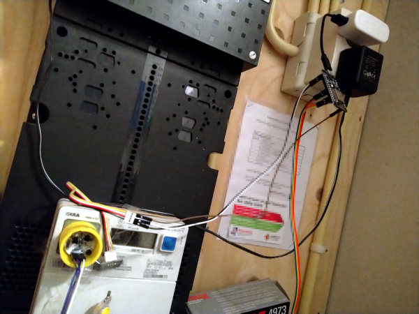
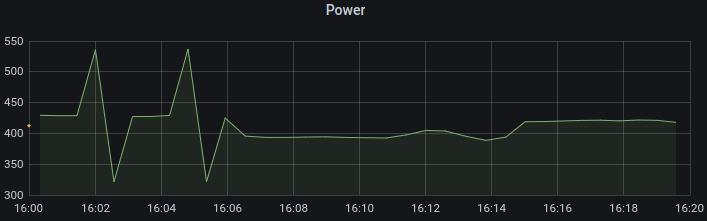
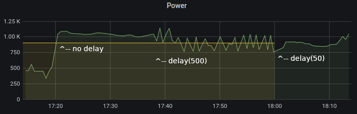
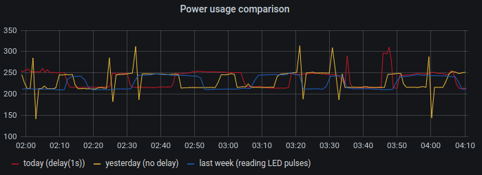

pe32me162ir_pub
===============

Project Energy 32: *Talk to ISKRA ME162 through optical port, export to MQTT.*

On the `Hal9k Kamstrup Project page
<https://wiki.hal9k.dk/projects/kamstrup>`_ (by Aalborg hackers) you can
find instructions to build an *optical probe* (infrared transceiver) to
communicate with *Kamstrup electricity meters* using the optical
communications port. Such an optical communication port is available on
several other electricity meters, like the *ISKRA ME-162* commonly found
in the Netherlands. This optical probe can also be used on those.

This project contains Arduino/ESP8266 code to read values from the
*ISKRA ME-162 electricity meter* and push them to an MQTT broker.

HOWTO
-----

1.  First, you order the probe kit from the Danes: on their `project page
    <https://wiki.hal9k.dk/projects/kamstrup>`_ they describe the
    contents and how to order.

    .. image:: assets/kamstrupkitv2.jpg

2.  Second, you solder the components together. Again, refer to the
    *Kamstrup Project page*.

    **BEWARE: The images on their page actually have the two BC547
    transistors depicted in reverse. If you look at the diagram, you'll
    find they should be rotated 180 degrees, with the Collectors
    connected to the 10k resistors.**

    .. image:: assets/kamstrup-diagram-as-png.png

    .. image:: assets/kamstrup-pcb-mirror-invert.png

    *(the PCB, as seen from the bottom)*

    .. image:: assets/pe32-soldered-ir-pcb.png

    *(my shabby soldering, with the BC547s turned the right way)*

    .. image:: assets/pe32-magnets.png

    *(gently inserting the magnets into the plastic shell, after
    widening the openings a bit)*

3.  Third, you test that the infrared transmitter works, by attaching it
    to an Arduino or similar, and running something like this:

    .. code-block:: c

        const int PIN_TX = 10;
        const int PIN_LED = 13;
        int val = LOW;

        void setup() {
          pinMode(PIN_TX, OUTPUT);
          pinMode(PIN_LED, OUTPUT);
        }

        void loop() {
          val = (val == LOW) ? HIGH : LOW;
          digitalWrite(PIN_TX, val);
          digitalWrite(PIN_LED, val);
          delay(1000);
        }

    This causes the Arduino LED and the TX LED to take turns lighting
    up. Because the TX LED will be off when the TX PIN is high.

    *When you look at the infrared LED with a digital photo camera (on
    your phone), you should be able to see the light as pink. (You can
    confirm that your camera sees it by looking at a TV remote control
    when it's transmitting.)*

    .. image:: assets/pe32-ir-test-tx.gif

4.  Fourth, you check that the infrared reception works. Run the
    following code:

    .. code-block:: c

        const int PIN_RX = 9;
        const int PIN_TX = 10;
        const int PIN_LED = 13;

        void setup() {
          pinMode(PIN_RX, INPUT);
          pinMode(PIN_TX, OUTPUT);
          pinMode(PIN_LED, OUTPUT);

          // TX must be HIGH (=no transmitted light), or RX will always
          // be HIGH (=no light reception).
          digitalWrite(PIN_TX, HIGH);
          digitalWrite(PIN_LED, HIGH);
        }

        void loop() {
          int val = digitalRead(PIN_RX);
          // Daylight or a bright lamp makes the Arduino LED go out.
          // Alternately, reception of a TV remote control infrared light
          // will cause visible flicker of the Arduino LED.
          if (val == LOW) {
            digitalWrite(PIN_LED, LOW);
            delay(50);
          } else {
            digitalWrite(PIN_LED, HIGH);
          }
        }

    When the RX photo transistor receives (infrared, but also other)
    light, the RX PIN will be pulled low. The sketch will pull the LED
    PIN low: LED off. (And vice versa: no IR light causes the LED to
    turn on.)

    .. image:: assets/pe32-ir-test-rx.gif

When you have completed the above steps, you should be able to hook it
up to your electricity meter. Check the comments at the top of the
`pe32me162ir_pub.ino <pe32me162ir_pub.ino>`_ source file for PIN details
and configuration.

After hooking everything up, your meter cupboard might look like this:

*Note that setting up a MQTT broker and a subscriber for the pushed data
is beyond the scope of this HOWTO. Personally, I use Mosquitto (broker),
a custom subscriber, PostgreSQL (with timescale) and Grafana for
visualisation.*

MQTT messages
-------------

At the moment, the MQTT messages will look as follows.

Initial publish after device startup::

    device_id=...&id=ISK5ME162-0033&DATA=
      C.1.0(28342193)\r\n0.0.0(28342193)\r\n1.8.0(0032916.425*kWh)\r\n
      1.8.1(0000000.000*kWh)\r\n1.8.2(0032916.425*kWh)\r\n
      2.8.0(0000000.001*kWh)\r\n2.8.1(0000000.000*kWh)\r\n
      2.8.2(0000000.001*kWh)\r\nF.F(0000000)\r\n!\r\n

Consecutive publishes look like::

    device_id=EUI48:11:22:33:44:55:66&
      e_pos_act_energy_wh=33134208&e_pos_inst_power_w=693&
      e_neg_act_energy_wh=1&e_neg_inst_power_w=0&
      dbg_uptime=168355

Where the keys mean:

- e_pos_act_energy_wh (1.8.0) = Positive active energy [Wh]
- e_neg_act_energy_wh (2.8.0) = Negative active energy [Wh]
- e_pos_inst_power_w (1.7.0) = Positive active instantaneous power [Watt]
- e_neg_inst_power_w (2.7.0) = Negative active instantaneous power [Watt]

**BEWARE: The MQTT message format is not well thought out nor
standardized. I will change it at some point without prior notice! 😈**

The issue with the odd spikes
-----------------------------

(Note, the following issue was only relevant up until commit `d844533
<https://github.com/wdoekes/pe32me162ir_pub/commit/d84453351f3ede232571281e643d02eb6fb785e4>`_
After that commit, visible LED pulses are not that important because we
query the meter for totals every second. You now need to enabled
``OPTIONAL_LIGHT_SENSOR`` for this functionality.)

Occasionally, we would see these odd spikes::

    +34.0  16:00:53 {'e_pos_act_energy_wh': 32917428, 'e_pos_inst_power_w': 428, 'dbg_uptime': 6807478, 'dbg_pulse': '1..101'}
    +34.0  16:01:27 {'e_pos_act_energy_wh': 32917432, 'e_pos_inst_power_w': 428, 'dbg_uptime': 6841062, 'dbg_pulse': '1..133'}
    +33.0  16:02:00 {'e_pos_act_energy_wh': 32917437, 'e_pos_inst_power_w': 535, 'dbg_uptime': 6874655, 'dbg_pulse': '1..111'}
    +34.0  16:02:34 {'e_pos_act_energy_wh': 32917440, 'e_pos_inst_power_w': 321, 'dbg_uptime': 6908240, 'dbg_pulse': '1..171'}
    +33.0  16:03:07 {'e_pos_act_energy_wh': 32917444, 'e_pos_inst_power_w': 427, 'dbg_uptime': 6941936, 'dbg_pulse': '1..192'}
    +34.0  16:03:41 {'e_pos_act_energy_wh': 32917448, 'e_pos_inst_power_w': 427, 'dbg_uptime': 6975619, 'dbg_pulse': '1..161'}
    +34.0  16:04:15 {'e_pos_act_energy_wh': 32917452, 'e_pos_inst_power_w': 429, 'dbg_uptime': 7009170, 'dbg_pulse': '1..157'}
    +33.0  16:04:48 {'e_pos_act_energy_wh': 32917457, 'e_pos_inst_power_w': 536, 'dbg_uptime': 7042692, 'dbg_pulse': '1..118'}
    +34.0  16:05:22 {'e_pos_act_energy_wh': 32917460, 'e_pos_inst_power_w': 321, 'dbg_uptime': 7076275, 'dbg_pulse': '1..174'}
    +34.0  16:05:56 {'e_pos_act_energy_wh': 32917464, 'e_pos_inst_power_w': 424, 'dbg_uptime': 7110158, 'dbg_pulse': '1..133'}
    +36.0  16:06:32 {'e_pos_act_energy_wh': 32917468, 'e_pos_inst_power_w': 395, 'dbg_uptime': 7146556, 'dbg_pulse': '1..134'}

That is, at ``16:02:00``, there appears to be a Wh value too many (+5
instead of +4) which is compensated for at ``16:02:34`` (+3 instead of
+4). And, again at ``16:04:48`` and ``16:05:22``. Instead of 535 and 321
Watt, we'd expect 423 and 436 Watt.

These always appear to be early counts, not late ones.

*A possible cause could be that we're always getting a value too early:
if the LED pulse is sent before the Wh is counter is incremented, we might
"normally" get a pulse too little, and only sometimes we'd get the right
value (i.e. one more).*

The above graph initially seemed to disprove that theory, but after
increasing the delay to a full second, the spikes disappeared.

Now the new graph is more in line with the "old" counter (which was
still in use last week) which `read the LED pulses
<https://github.com/wdoekes/pe32me162led_pub>`_ to indicate power
consumption.
